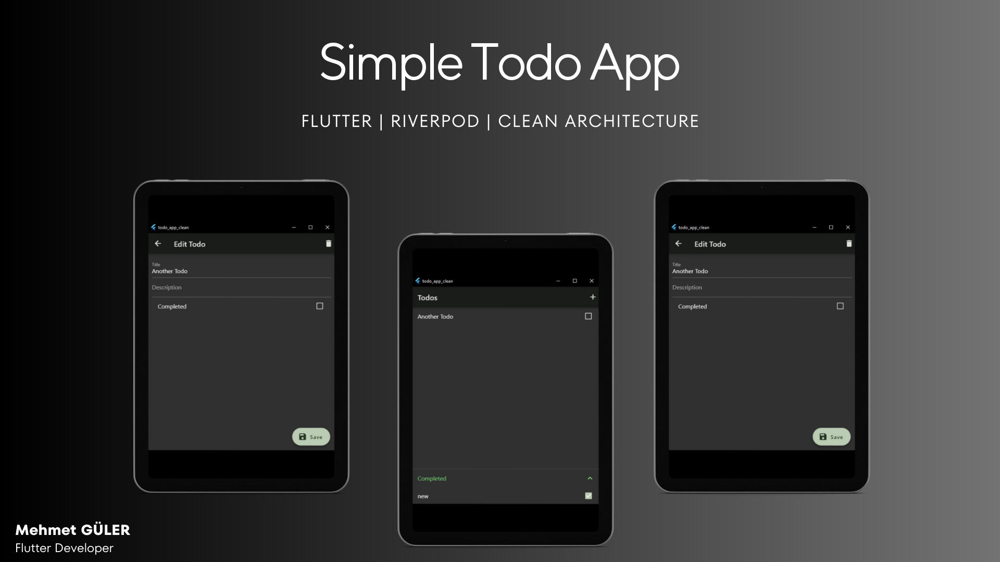

 

  <h3 align="center">Flutter Simple Todo App</h3>

  

    A Flutter project with Clean Architecture, Riverpod and more!
     
     
    <a href="https://github.com/mhmetglrq/flutter_Todo_App/issues">Report Bug</a>
    .
    <a href="https://github.com/mhmetglrq/flutter_Todo_App/issues">Request Feature</a>
  

     

## About The Project

A news application developed using Flutter. Application follows the Clean Architecture principles and it coding with the Riverpod state management.

## Built With

Clean Architecture is an approach that ensures clean and sustainable code in software projects. This architecture divides the project into layers, with each layer having specific responsibilities. Typically, a three-layered structure is used: the presentation layer, the domain layer, and the data layer.

Riverpod is a state management library for Flutter that works well with Clean Architecture principles. It is based on the Provider package but offers additional features and benefits. Riverpod provides a simple and efficient way to manage and share state throughout the app.

When using Riverpod with Clean Architecture, you can define your providers at different levels of the architecture. For example, UI-related providers can be declared in the widget tree, while domain-specific providers can reside in the domain layer. This separation ensures that the business logic remains independent of the UI, promoting modularity and easier testing.

By combining Clean Architecture with Riverpod, developers can build robust Flutter applications with a clear separation of concerns, making it easier to maintain, extend, and test the codebase. The decoupling of UI and business logic enables developers to iterate on the UI without affecting the underlying functionality, resulting in a more flexible and scalable codebase.

Packages:

* [freezed](https://pub.dev/packages/freezed)
* [freezed_annotation](https://pub.dev/packages/freezed_annotation)
* [json_annotation](https://pub.dev/packages/json_annotation)
* [flutter_riverpod](https://pub.dev/packages/flutter_riverpod)
* [collection](https://pub.dev/packages/collection)
* [go_router](https://pub.dev/packages/go_router)
* [riverpod_annotation](https://pub.dev/packages/riverpod_annotation)
* [riverpod_generator](https://pub.dev/packages/riverpod_generator)
* [json_serializable](https://pub.dev/packages/json_serializable)
* [build_runner](https://pub.dev/packages/build_runner)

### Creating A Pull Request

1. Fork the Project
2. Create your Feature Branch (`git checkout -b feature/AmazingFeature`)
3. Commit your Changes (`git commit -m 'Add some AmazingFeature'`)
4. Push to the Branch (`git push origin feature/AmazingFeature`)
5. Open a Pull Request
